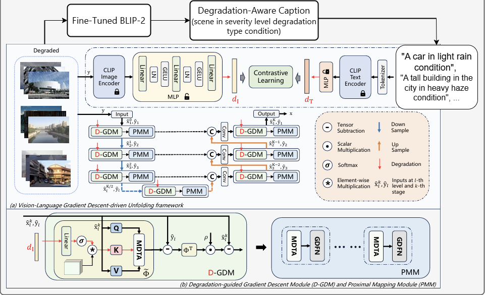
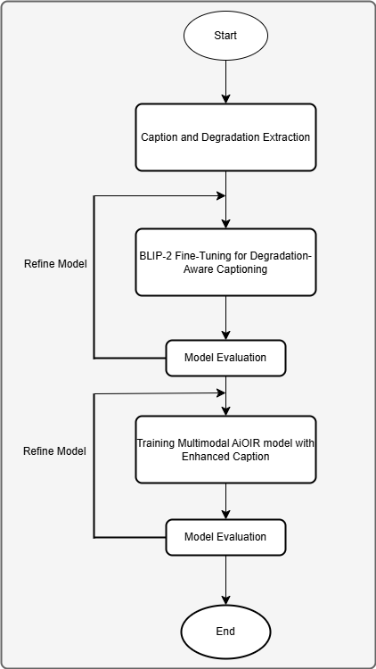
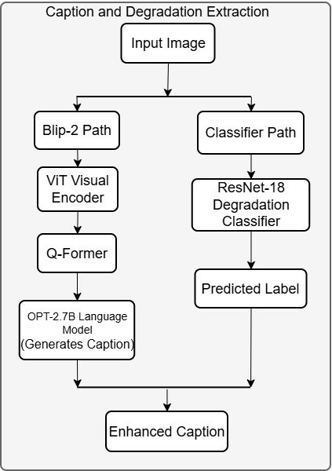
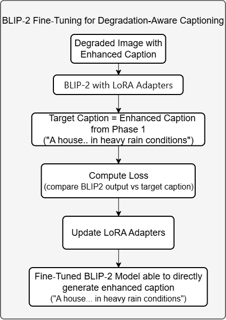
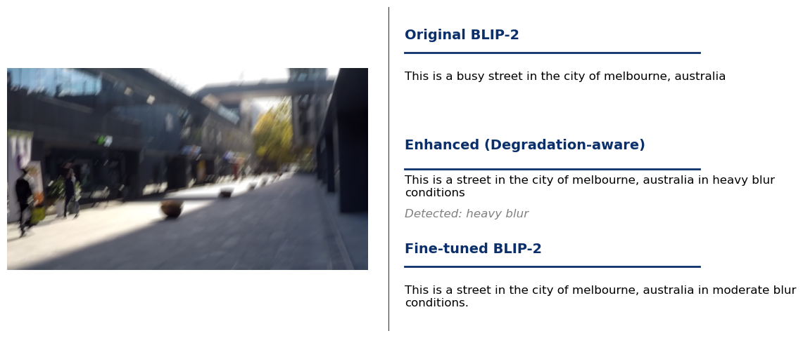

# 🖼️ BLIP-VLU-Net Assets

This directory contains visual assets, documentation materials, and qualitative evaluation results associated with the **BLIP-VLU-Net** research and repository. 

## 📂 Folder Structure

- **`DegradationSeverityLevels/`**  
  Contains visual examples demonstrating different severity levels of various image degradations (e.g., haze, rain, noise, low-light) used in the study.

- **`EvaluationOfDegradation/`**  
  Contains degraded images showcasing the original BLIP caption, the enhanced caption (with classification predictions), and the fine-tuned BLIP-2 caption.

- **`QualitativeResult/`**  
  Contains comparative output images demonstrating the restoration quality of BLIP-VLU-Net against baseline models (e.g., single-task models, 3-task NHR, and 5-task NHRBL results).

- **`figures/`**  
  Contains high-level architectural diagrams, including the overall framework and phase flowcharts used throughout the repository's documentation.

- **`poster/`**  
  Contains academic posters and presentation materials summarizing the BLIP-VLU-Net methodology and qualitative findings.

---

## 🖼️ Architectural Overview

### 1. Overall Framework

**Description:** The overall architecture of the BLIP-VLU-Net model, illustrating how vision-language priors from BLIP-2 are integrated with the VLU-Net backbone to dynamically guide the restoration process based on the input image's degradation severity and type.

**Primary Goal:** Integrate a fine‑tuned BLIP‑2 model to generate severity‑aware captions, convert them to CLIP embeddings, and use them to guide VLU‑Net's restoration stages — achieving restoration that is both type‑aware and severity‑aware through a single model.

### 2. General Flow
 

**Description:** This image summarises the general idea motivating this project. Traditional deep‑unfolding methods rely on manual or task‑specific transform selection, separating restoration per predefined degradation tasks. In contrast, the hierarchical unfolding design employs a vision‑language model to provide automatic semantic guidance. Here, BLIP‑VLU‑Net improves the language guidance: captions become degradation‑aware, encoding both type and severity. The workflow connects three components: (1) enhanced captions built from a BLIP‑2 scene description combined with a classifier‑based degradation type‑severity phrase; (2) BLIP‑2 fine‑tuned with LoRA to generate similar severity‑aware captions directly from degraded images; (3) these captions are converted to CLIP/OpenCLIP text embeddings that serve as semantic priors for BLIP‑VLU‑Net during training, testing, and web‑viewer evaluation. This creates a caption‑to‑embedding‑to‑restoration pipeline rather than isolated steps.

### 3. Phase 0: Environment Setup and Original VLU‑Net Baseline Verification

**Description:** The development environment is configured (conda environment, dependencies, CUDA/cuDNN), and the required datasets are downloaded and organised. The original VLU‑Net model is reproduced to establish baseline PSNR/SSIM scores. During this phase, the original BLIP‑2 model is also tested on degraded images, revealing the key limitation: its captions describe only scene content and fail to capture degradation type or severity — motivating the subsequent phases.

### 4. Phase 1: Enhanced Captioning
 

**Description:** Because the original BLIP‑2 caption cannot describe degradation type and severity, we first train a ResNet‑18 classifier to predict these attributes. The image is then processed through two parallel paths: BLIP‑2 generates a base caption, while the classifier provides a degradation phrase (e.g., “heavy rain conditions”). Merging them yields an enhanced caption (e.g., “a house with trees in heavy rain conditions”), which is used as supervision for Phase 2 fine‑tuning of BLIP‑2 via LoRA. The workflow is illustrated in Phase 2 Workflow Image.

### 5. Phase 2: BLIP‑2 Fine‑Tuning for Severity‑Aware Captioning
 

**Description:** The goal of Phase 2 is to eliminate the degradation classifier from the inference path by fine‑tuning BLIP‑2 so that, given only a degraded image and a fixed prompt (e.g., "Question: Describe this scene."), it directly generates an enhanced caption containing both scene description and degradation type‑severity (e.g., "a house with trees in heavy rain conditions"). Supervised training pairs consist of the degraded image + prompt as input and the enhanced caption (baseline BLIP‑2 caption concatenated with the classifier‑derived severity phrase) as target.

#### Comparison Example

**Description:** A side‑by‑side comparison of captions generated for a blurry degraded image. It shows (1) the original BLIP‑2 caption, which describes the scene but lacks any degradation awareness; (2) the enhanced caption, constructed by merging the BLIP‑2 caption with the ResNet‑18 classifier's degradation‑type and severity prediction; and (3) the fine‑tuned BLIP‑2 caption, which produces the degradation‑aware description directly without the classifier.

### 6. Phase 3: CLIP Text Embedding Extraction

**Description:** In the original VLU‑Net, predefined degradation labels (e.g., "rainy image", "blurry image") are passed into the text tokenizer to produce the language embeddings that guide the restoration network. In Phase 3 of BLIP‑VLU‑Net, these static labels are replaced with the rich, degradation‑aware captions generated by the fine‑tuned BLIP‑2 model from Phase 2. The fine‑tuned captions are fed into the CLIP/OpenCLIP tokenizer, producing text embeddings that carry both scene context and severity information. These embeddings then serve as semantic priors for the subsequent training and evaluation phases.

### 7. Phase 4: BLIP‑VLU‑Net Training

**Description:** Using the CLIP text embeddings extracted in Phase 3, the VLU‑Net restoration backbone is trained with degradation‑aware semantic guidance. The text embeddings condition the hierarchical unfolding stages, enabling the network to dynamically adapt its restoration behaviour based on the specific degradation type and intensity described in the caption.

### 8. Phase 5: BLIP‑VLU‑Net Testing and Evaluation

**Description:** The trained BLIP‑VLU‑Net model is evaluated on benchmark datasets across single‑task and multi‑task restoration settings (e.g., 3‑task NHR and 5‑task NHRBL). Quantitative metrics such as PSNR and SSIM are computed to measure restoration quality, alongside qualitative visual comparisons against baseline models.

### 9. Phase 6: Web Viewer Prototype for Result Visualisation

**Description:** A React‑based interactive web viewer is developed to visualise and compare restoration results. It supports dataset‑level metric browsing (PSNR/SSIM) as well as an upload‑and‑restore feature that performs live model inference, allowing users to test BLIP‑VLU‑Net on their own degraded images.

---

## 📊 Findings

### Ablation Study on Embedding Dimension

An ablation study was conducted to compare BLIP‑VLU‑Net using two degradation embedding dimensions: **d_edim = 7** and **d_edim = 5**. This examines whether the size of the degradation‑guidance embedding affects restoration performance after the BLIP‑generated caption is converted into the semantic prior used by the restoration network.

| Task | d_edim = 7 PSNR | d_edim = 7 SSIM | d_edim = 5 PSNR | d_edim = 5 SSIM |
|------|:---:|:---:|:---:|:---:|
| Dehazing | **31.73** | **0.9795** | 31.22 | 0.9785 |
| Deraining | **38.58** | **0.9833** | 38.49 | 0.9832 |
| Deblurring | **29.01** | **0.8785** | 28.80 | 0.8751 |
| Low‑light enhancement | 22.83 | **0.8175** | **22.86** | 0.8101 |

> **Bold** values indicate the better result between the two settings for each metric.

The 7‑dimensional setting achieves consistently higher PSNR and SSIM on dehazing, deraining, and deblurring. For low‑light enhancement, d_edim = 5 gives a marginally higher PSNR (22.86 vs 22.83), but d_edim = 7 still obtains the higher SSIM. Since the low‑light PSNR difference is negligible and d_edim = 7 delivers more consistent performance across all degradation types, the **7‑dimensional embedding is adopted as the final BLIP‑VLU‑Net configuration**.

A larger embedding dimension provides a richer representation of the degradation information. With seven dimensions instead of five, the model has slightly more capacity to encode characteristics such as degradation type and severity, allowing the restoration network to receive more informative guidance and resulting in improved restoration performance.

### Degradation Type Prediction Accuracy Comparison

A comparison between the classifier‑assisted enhanced‑caption (Phase 1) and the fine‑tuned BLIP‑2 (Phase 2) for degradation‑type detection accuracy. **Prediction Ratio** is the proportion of images assigned to the most frequent predicted type–severity label within each folder, while **Type Acc.** is the proportion assigned to the correct degradation type after combining severity levels (unknown labels excluded).

| Test Folder | Cls. Top Label | Cls. Pred. Ratio | Cls. Type Acc. | BLIP‑2 Top Label | BLIP‑2 Pred. Ratio | BLIP‑2 Type Acc. |
|---|---|:---:|:---:|---|:---:|:---:|
| GoPro Blur | light blur | 41.94% | 92.52% | light blur | 43.74% | 90.90% |
| SOTS_outdoors Hazy | moderate haze | 59.40% | 96.60% | moderate haze | 73.40% | 87.00% |
| LoL Low‑light | heavy lowlight | 70.31% | 100.00% | heavy lowlight | 93.33% | 100.00% |
| CBSD68 Noisy15 | light noise | 92.65% | 100.00% | light noise | 50.00% | 88.24% |
| CBSD68 Noisy25 | moderate noise | 98.53% | 100.00% | light noise | 38.24% | 91.18% |
| CBSD68 Noisy50 | heavy noise | 100.00% | 100.00% | heavy noise | 54.41% | 95.59% |
| Urban100 Noisy15 | light noise | 78.00% | 94.00% | heavy noise | 45.00% | 82.00% |
| Urban100 Noisy25 | moderate noise | 78.00% | 97.00% | heavy noise | 45.00% | 83.00% |
| Urban100 Noisy50 | heavy noise | 95.00% | 100.00% | heavy noise | 45.00% | 87.00% |
| Rain100L Rainy | light rain | 92.00% | 96.00% | light rain | 94.00% | 99.00% |

Both stages correctly identified the degradation type in most cases, especially for low‑light, rain, and several noise folders. The classifier‑assisted stage achieved higher type accuracy in several rows because it uses a closed‑set classifier label, making it more reliable under well‑defined degradation distributions. However, this comes with a trade‑off: Phase 1 produces more concentrated predictions due to explicit classifier supervision, while Phase 2 produces more flexible but slightly more dispersed representations via end‑to‑end generation.

The fine‑tuned BLIP‑2 model remains important because it generates both the scene description and degradation phrase directly from the degraded image, supporting a more end‑to‑end captioning process and reducing the need for manual caption fusion during inference. Its purpose is to encourage the system to learn a **continuous visual degradation representation** from image content rather than relying only on discrete predefined class labels. This design integrates naturally with the downstream caption‑to‑embedding‑to‑restoration pipeline, as the generated caption can be passed directly into the CLIP/OpenCLIP embedding stage.

---

## 🏁 Conclusion

This project proposes **BLIP‑VLU‑Net**, a severity‑aware All‑in‑One Image Restoration framework using a fine‑tuned BLIP‑2, CLIP embeddings, and a VLU‑Net backbone to incorporate degradation type and severity into restoration. Results show competitive performance and visually consistent outputs across haze, rain, and low‑light conditions, demonstrating that vision‑language guidance improves restoration adaptability. Overall, the work confirms the effectiveness of degradation‑aware vision‑language integration for all‑in‑one image restoration.
